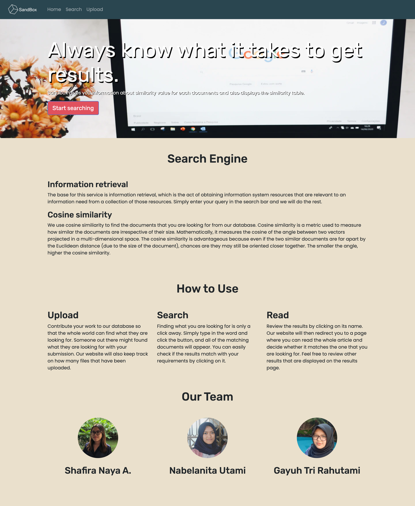

# SandBox
> A simple search engine website for searching documents

## Table of contents
* [General info](#general-info)
* [Screenshots](#screenshots)
* [Setup](#setup)
* [How to Use](#how-to-use)
* [Status](#status)
* [Credits](#credits)
* [Contact](#contact)

## General info
SandBox is a simple search engine website for documents that uses similarity cosine as its searching method. Simply enter your query in the searchbar and click search. SandBox will then display the results sorted from the highest similarity rate. Every result has a clickable name that will direct you to a page where you can examine the document contents. The results page also provide a similarity table that keep count of the number of query that is found inside each document inside our database

You can also upload your own document to be included inside our database. Direct to the upload page and choose the .txt file that you wish to upload. As soon as you do, other users can now find your uploaded file in their search results.


## Screenshots



## Setup
1. Install the latest Python version from the website https://www.python.org/downloads/. Make sure the version that you install is higher than Python 3.0.0
2. Install nltk, flask, flask_wtf by entering the following command inside your terminal:<br />
```
pip install nltk
pip install flask
pip install flask_wtf
```
3. Type the following command inside the terminal to clone the project: <br />
`git clone https://github.com/shafiranaya/Algeo02-19040`
5. Move to `src` folder by typing this command: <br />
`cd Algeo02-19040/src`
6. Run the app by typing: <br />
`python3 app.py`
7. The terminal will give you a link where the website is hosted. (For most cases it's http://127.0.0.1:5000/)

## Status
Project is: Finished!

## Credits
Unsplash

## Contact
Created by:  
1. Shafira Naya (@shafiranaya) - 13519040  
2. Nabelanita Utami (@nabelanita) - 13519104  
3. Gayuh Tri Rahutami (@wundersmith) - 13519192  


